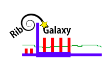

Welcome to RiboGalaxy's 'how-to-build' documentation.
===================================

**RiboGalaxy**, a Galaxy-based platform for processing ribo-seq data from raw reads to genomic and transcriptomic alignments, is one of three `Riboseq.org <https://riboseq.org/>`_. resources. RiboGalaxy facilitates reproducible data analysis without any sophisticated environment setups for users and enables more accessible scientific discoveries. 

Here I share how to build a RiboGalaxy instance. Many steps include following tutorials from `Galaxy Admin Track 2021 <https://training.galaxyproject.org/archive/2021-08-01/topics/admin/>`_ with multiple changes in configuration. 

Check out the :doc:`Overview of installation process` section for further information, including
how to :ref:`hardware` the project.

.. note::

   This project is under active development. If you notice any bugs, please don't hesitate to send an email to ribogalaxy@gmail.com.  

Contents
--------

.. toctree::

   Overview of installation process
   Galaxy Installation with Ansible
   Running jobs with Singularity
   Connecting Galaxy to a compute cluster (Slurm)
   Mapping jobs to destinations
   Allow large files to be handled via FTP
   Database accession
   Server cleanup
   Quotas and job limits 
   Server maintenance and backup
   Changing tool panel
   Customise Welcome page 
   Reports 
   Grafana/Telegraf monitoring 
   Google analytics
   Tools 
   Common bug fix 
